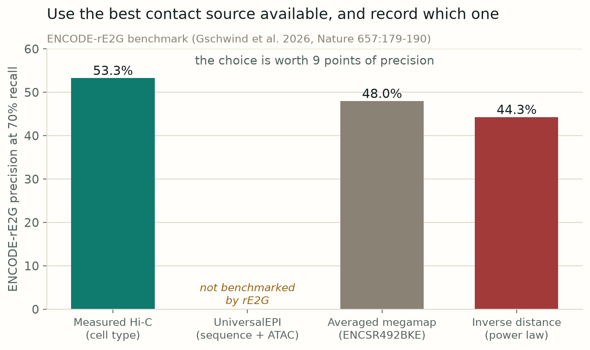
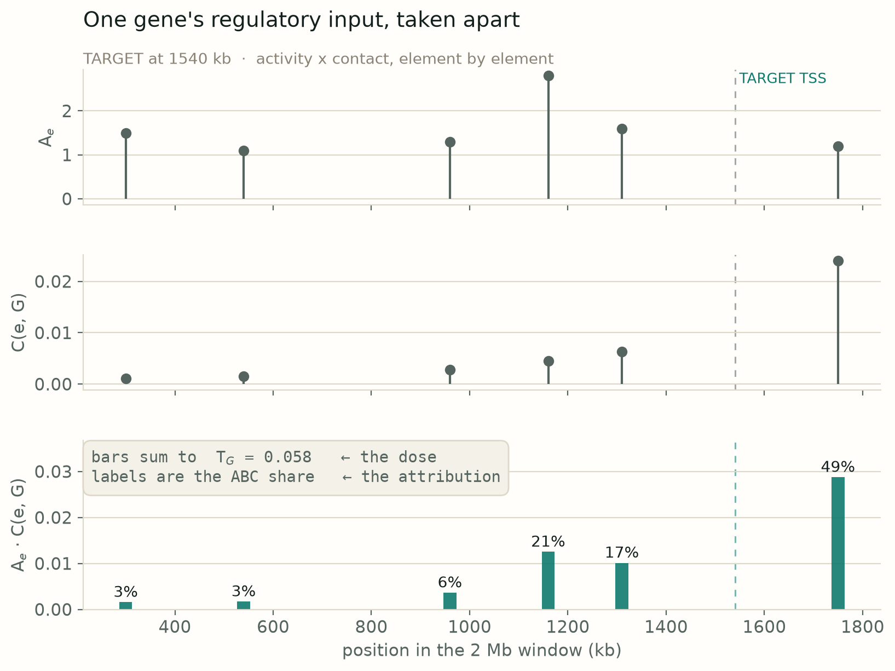
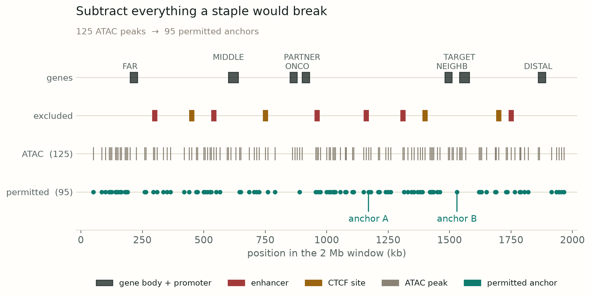
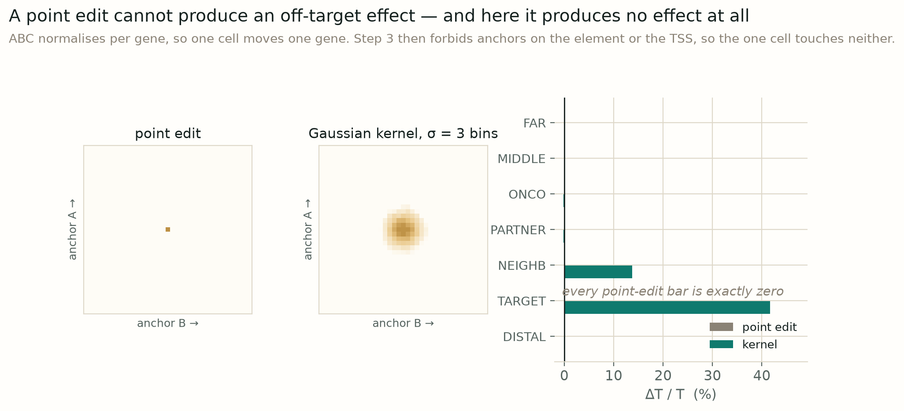
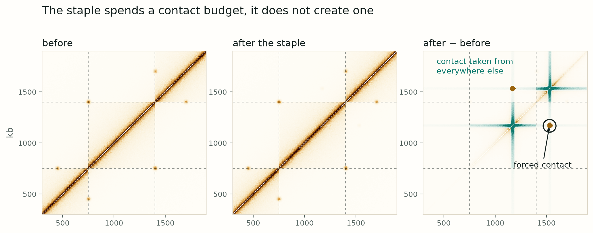
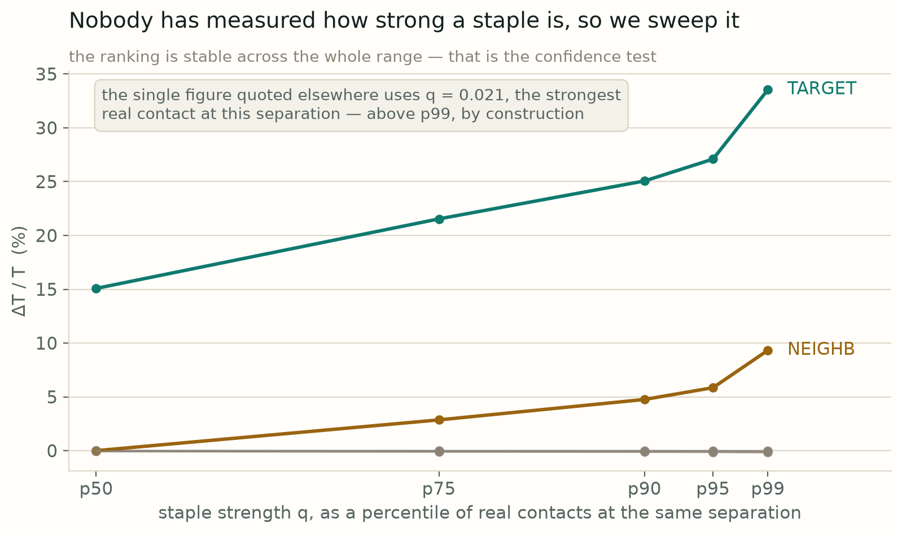
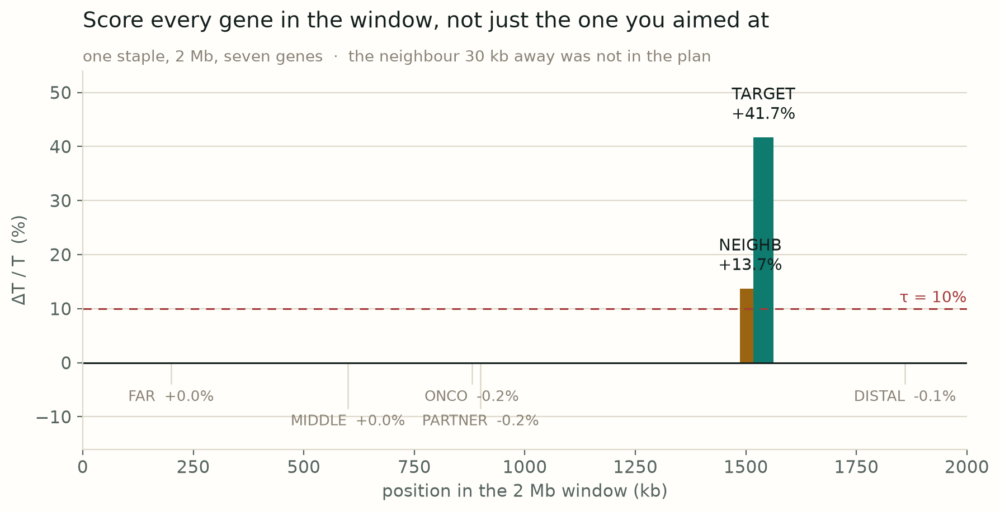
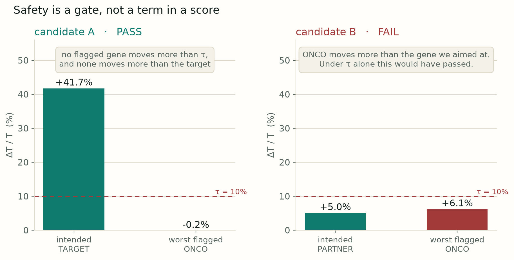

# Figure series — the method, step by step

Generated by `animation/figures/method_figures.py`. Every number comes from `pipeline.simulate`, the same code path the pipeline runs. Inputs are synthetic (`pipeline/locus.py`, `illustrative: true`); the arithmetic on them is real.

## Step 1 — the contact map

Measured Hi-C beats every prediction, so where it exists we use it and bypass the model entirely. UniversalEPI fills in cell types with no Hi-C from sequence and ATAC; a cell type with neither falls back to the averaged megamap or plain inverse distance, at a cost of nine points of precision. Whichever rung was used is written into the record, so a reviewer can see what a claim rests on.

## Step 2 — ABC, and the two numbers it gives you

Activity times contact, element by element. The bars sum to T, the gene's total regulatory input; the percentages are the ABC score, each element's share of that total. They answer different questions. The share is normalised per gene and always sums to 100%, so after an intervention it reports redistribution, not increase. T is the dial a staple is meant to turn, and dT/T is what we report.

## Step 3 — filter the physical conflicts

An anchor has to be open chromatin the machinery can bind, minus everything we would break by parking a protein on it: the enhancer itself, the promoter and 5 kb either side, the transcribed body, and CTCF boundary sites. This is a filter, not a score — it removes the impossible rather than ranking the possible, which is why 'tractable' does not need to be an axis in the ranking.

## Step 4a — the intervention has to be a blob

ABC's denominator is per gene, so editing a single cell of the contact matrix can only move the gene you aimed at. Enhancer hijacking becomes arithmetically impossible and the off-target analysis returns zeros by construction. A model that cannot express the failure mode cannot rule it out. So the staple deposits a Gaussian blob, sigma about 3 bins or 15 kb — a width with empirical support: rE2G found significant CRISPRi crosstalk between elements 1-10 kb apart, P = 1.8e-5.

## Step 4b — what the edit actually did

Left and centre look almost identical, which is the point: subtract them. The amber blob is the contact we forced between the two anchors. The teal stripes running along both anchor rows are contact taken away from everywhere else, because we hold each locus's total contact budget fixed. Without that constraint a staple would add closeness for free, nothing could ever go down, and enhancer theft would be unrepresentable.

## Step 4c — sweep the strength instead of guessing it

No one has measured the contact frequency a dCas staple produces, so we refuse to pick a number. We sweep q across the range of real contacts observed at the same genomic separation and report the whole curve. This turns an unknown parameter into an output. It also gives the confidence test teeth: if the ordering of genes flips as q varies, we do not know the answer and the candidate is marked tentative.

## Step 5 — the window readout

The target gains 42% of regulatory input, which is what we wanted. A neighbouring promoter 30 kb away gains 14%, which we did not want and would never have seen had we scored only the gene we aimed at. The flagged genes elsewhere in the window do not move. This panel is the whole argument for simulating the intervention rather than just scoring the target.

## Step 6 — the gate, and the ordering

Two tests, because they fail for different reasons. Absolute: no flagged gene moves more than tau, which we start at 10%. Relative: no flagged gene moves more than the gene we were aiming at — candidate B does 6.1% to an oncogene and only 5.0% to its target, so it dies even though both numbers are small and tau alone would have let it through. A weighted score would allow a large predicted effect to outrank a safety concern. A gate cannot. Survivors are then ordered by dT/T, with the confidence tier shown beside each row rather than sorted on.
